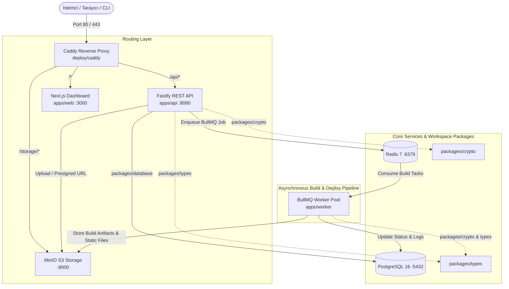

# 🏛️ PulseOps Sistem Mimarisi

Bu doküman, **PulseOps** bulut dağıtım platformunun sistem mimarisini, bileşenler arası veri akışını, kuyruk yönetimini, depolama stratejisini ve ters vekil sunucu yapılandırmasını açıklar.

---

## 1. Genel Mimari Şeması



---

## 2. Sistem Bileşenleri

### 2.1. `apps/api` (Fastify REST API)
- **Teknoloji**: Node.js, TypeScript, Fastify, `@fastify/cors`, `@fastify/sensible`
- **Görevler**:
  - `/health`: PostgreSQL, Redis ve MinIO bağlantılarını ve gecikmelerini kontrol eder.
  - `/api/v1/deployments`: Yeni dağıtım oluşturur, PostgreSQL'e yazar, BullMQ kuyruğuna (`deployment-queue`) iş fırlatır.
  - `/api/v1/deployments/:id`: Dağıtım durumunu ve adım adım derleme loglarını (`build_logs`) döner.
  - `/api/v1/stats`: Toplam dağıtım, aktif kuyruk işi ve başarı oranlarını hesaplar.
  - MinIO ile entegre olarak artefaktlar için presigned URL ve bucket yönetimi sağlar.

### 2.2. `apps/worker` (BullMQ Build Worker)
- **Teknoloji**: Node.js, TypeScript, BullMQ, Redis, MinIO Client
- **Görevler**:
  - `deployment-queue` kuyruğunu dinler.
  - Dağıtım aşamalarını (Git Clone -> Bağımlılık Çözümü -> Derleme/Paketleme -> Statik Optimizasyon -> MinIO Yüklemesi -> Edge Dağıtım) adım adım çalıştırır.
  - Her adımı ve süresini gerçek zamanlı log olarak PostgreSQL'e yazar.
  - Başarılı derleme sonrası artefaktları MinIO bucket'ına (`mini-vercel-builds`) yükler ve önizleme URL'ini (`preview_url`) üretir.
  - Zarif kapanma (Graceful shutdown) ile mevcut işlerin güvenle tamamlanmasını sağlar.

### 2.3. `apps/web` (Next.js Dashboard)
- **Teknoloji**: Next.js 16 (App Router), React 19, Tailwind CSS, Lucide Icons, TypeScript
- **Görevler**:
  - Servislerin canlı sağlık durumunu (API, Worker, PostgreSQL, Redis, MinIO) gösterir.
  - Gerçek zamanlı metrik kartları (Toplam Dağıtım, Aktif Kuyruk, Başarı Oranı, Ortalama Derleme Süresi).
  - Tek tıkla yeni dağıtım tetikleme formu (hazır şablonlar dahil).
  - Canlı terminal görünümünde adım adım log izleme modalı.
  - MinIO & Edge önizleme bağlantılarına doğrudan erişim.

### 2.4. Paylaşılan Paketler (`packages/`)
- **`packages/types`**: API, Worker, Web ve Veritabanı arasında paylaşılan TypeScript arayüzleri (`Deployment`, `BuildLog`, `QueueJobPayload`, `HealthResponse`, vb.).
- **`packages/database`**: PostgreSQL bağlantı havuzu, migration yardımcıları ve veri erişim katmanı (Data Access Layer).
- **`packages/crypto`**: Güvenli token üretimi, SHA-256 commit/artefakt hashleme, HMAC imza doğrulama yardımcı fonksiyonları.

### 2.5. Altyapı ve Dağıtım Katmanı
- **PostgreSQL 16**: Projeler, dağıtımlar ve derleme loglarının kalıcı ilişkisel veri tabanı.
- **Redis 7**: BullMQ için yüksek performanslı kuyruk ve durum yönetimi motoru.
- **MinIO**: S3 uyumlu nesne depolama (Object Storage) — derleme çıktıları, HTML/JS/CSS statik paketleri.
- **Caddy**: Otomatik TLS/SSL yeteneğine sahip modern ters vekil sunucu (Reverse Proxy) — domain ve rota yönlendirmesi.
- **Docker Compose**: Tüm servisleri tek komutla (`docker compose up -d`) ayağa kaldıran orkestrasyon dosyası.
- **Turborepo & pnpm**: Hızlı paralel derleme, önbellekleme ve bağımlılık yönetimi.

---

## 3. Dağıtım (Deployment) Yaşam Döngüsü

```
[İstemci / Web UI] 
       │
       ▼ (POST /api/v1/deployments)
[apps/api] ──► [PostgreSQL: Status=QUEUED]
       │
       ▼ (BullMQ add job)
[Redis: deployment-queue]
       │
       ▼ (Worker process job)
[apps/worker] ──► [PostgreSQL: Status=BUILDING]
       │
       ├─► 1. CLONE: Git repo klonlama
       ├─► 2. DEPENDENCIES: Paket bağımlılıkları çözümleme
       ├─► 3. COMPILE: Next.js / framework derlemesi
       ├─► 4. ARTIFACTS: Artefaktları MinIO S3 bucket'a yükleme
       └─► 5. DEPLOY: Edge CDN / Preview yönlendirmesi
       │
       ▼ (Tamamlandı)
[PostgreSQL: Status=READY, preview_url=https://..., duration_ms=...]
```

---

## 4. Güvenlik ve Dayanıklılık
- **Tip Güvenliği**: TypeScript ve `packages/types` ile uçtan uca tip güvenliği.
- **İzolasyon**: Docker ağları (`mini_vercel_network`) ile güvenli iç haberleşme.
- **Sağlık Kontrolleri (Health Checks)**: Hem Docker Compose düzeyinde hem de Fastify `/health` endpoint'inde periyodik doğrulama.
- **Hata Toleransı**: BullMQ otomatik yeniden deneme (retry) ve hata yakalama mekanizmaları.
